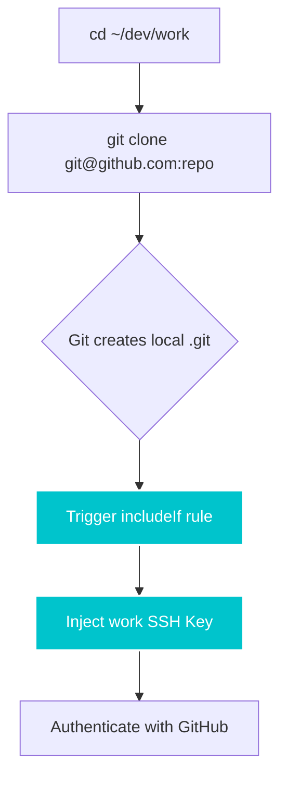

<div align="center">


# gideon

**The Zero-Dependency Git Identity Orchestrator.**  
*One command. All identities. Every machine.*

[](.github/workflows/ci.yml)
[](https://www.shellcheck.net/)
[](LICENSE)
[](https://www.gnu.org/software/bash/)
[]()

<br/>

> **[🎥 Watch the 60-Second Demo](#)** *(Placeholder for Asciinema GIF)*

</div>

---

## ⚡ Why Gideon?

You work with multiple Git identities — personal, work, freelance, and open-source. Every new machine, VM, or container requires you to manually generate SSH keys, carefully edit `~/.gitconfig`, configure `~/.ssh/config`, upload keys to your provider, and hope you didn't make a typo that haunts your commit history forever.

**Gideon obliterates this workflow in 60 seconds.**

Gideon is a pure-Bash CLI tool that bootstraps your entire Git identity infrastructure from scratch. It asks you a few questions, generates the secure Ed25519 SSH keys, wires up your configurations, and silently enforces the correct identity based on the directory you are working in.

### 🚀 Quick Start

Install Gideon instantly to your `~/.local/bin` using the automated script:

```bash
curl -fsSL https://raw.githubusercontent.com/bhaskarjha-com/gideon/main/install.sh | bash
```

Once installed, run the interactive bootstrapper:

```bash
gideon setup
```

Answer the prompts, copy the generated public keys to your Git provider, and you're done. No dependencies. No runtimes. No hassle.

---

## ✨ The "Magical Clone" Workflow

Gideon provides a completely frictionless, alias-free experience. 

Other multi-identity tools require you to memorize custom SSH host aliases (like `git clone git@github-work:company/repo.git`). We fundamentally reject this design. With Gideon, you just clone normally.

1. **`cd` into your profile directory** (e.g., `cd ~/dev/work`)
2. **Clone normally**: `git clone git@github.com:company/repo.git`

### How is this possible?
Gideon leverages Git's native `includeIf` conditional rules. During the clone process, Git initializes the folder locally, immediately triggers Gideon's `includeIf` rule, reads the `core.sshCommand` for that specific profile, and **dynamically injects the correct SSH key mid-flight** before the connection to GitHub is ever made. 



*(For power users who prefer host-aliases over directory intercepts, Gideon fully supports **Manual Mode**. Just press `Enter` during the directory prompt.)*

---

## 🛡️ Identity Guard Hook

Ever accidentally pushed a commit to your company repository using your `anime_fan_99@gmail.com` email address? 

Gideon includes a global pre-commit hook that actively monitors your `$PWD` and blocks commits if your active `user.email` doesn't match the expected profile for that folder.

```bash
# Install the global identity guard
gideon guard --install
```

```text
$ git commit -m "fix critical auth bug"

⚠ gideon: Identity mismatch detected!
  Expected: engineering@company.com (profile: work)
  Actual:   personal@gmail.com

  Run 'gideon status' to investigate.
  Use --no-verify to skip this check.
```

---

## 💎 The Premium Engineering Promise

| Feature | gitego | gguser | git-profile | karn | **gideon** |
|---------|--------|--------|-------------|------|-----------|
| SSH key generation | ❌ | ❌ | ❌ | ❌ | ✅ |
| SSH config creation | ❌ | ❌ | ❌ | ❌ | ✅ |
| Git config with `includeIf` | ✅ | ❌ | ❌ | ❌ | ✅ |
| Pre-commit identity guard | ✅ | ❌ | ❌ | ❌ | ✅ |
| **Zero dependencies** | ❌ (Go) | ❌ (Node) | ❌ (Rust) | ❌ (Go) | ✅ (bash) |
| Cross-platform (WSL/VMs) | ✅ | ✅ | ⚠️ | ✅ | ✅ |
| Safe Idempotent Execution | ❌ | ❌ | ❌ | ❌ | ✅ |

- **Absolute Zero Dependencies:** Written in pure Bash 3.2. No Go, Node, Rust, or Homebrew required.
- **Strictly Idempotent:** Safe to run multiple times. Gideon marks its config sections with managed blocks and surgically edits them using stateful filters. It never corrupts your custom configurations.
- **Self-Healing:** Natively detects and fixes VirtualBox/WSL CRLF line-ending bugs, and automatically injects Git `safe.directory` rules to resolve "dubious ownership" errors on shared mounts.
- **Beautiful UI:** Features a high-fidelity ANSI terminal interface with interactive prompts, dynamic SSH loading spinners, and an ASCII dashboard status command.

---

## 🛠️ CLI Reference

| Command | Description |
|---------|-------------|
| `gideon setup` | Interactive setup wizard |
| `gideon setup --dry-run` | Preview what setup would do (no writes) |
| `gideon status` | Show current identity dashboard and all profiles |
| `gideon verify` | Test SSH keys, git config, and connectivity |
| `gideon teardown` | Remove all gideon configurations safely |
| `gideon guard --install` | Install pre-commit identity mismatch guard |
| `gideon guard --uninstall` | Remove the guard hook |
| `gideon --version` | Display version information |

---

## 📖 Deep Dives

To truly understand the philosophy and engineering behind Gideon, read the manifesto:
- **[The Gideon Manifesto & Architecture](docs/MANIFESTO.md)**: Why we rejected modern package managers to build an enterprise tool in Bash 3.2.
- **[Troubleshooting Guide](docs/TROUBLESHOOTING.md)**: Diagnostics for SSH and Git issues.

---

## 🤝 Contributing & License

Gideon is comprehensively tested with an automated 76-suite integration test covering edge cases across macOS, Linux, Git Bash, and VirtualBox shared mounts. 

See [CONTRIBUTING.md](CONTRIBUTING.md) for development guidelines.

[MIT License](LICENSE) — Created by Bhaskar Jha
