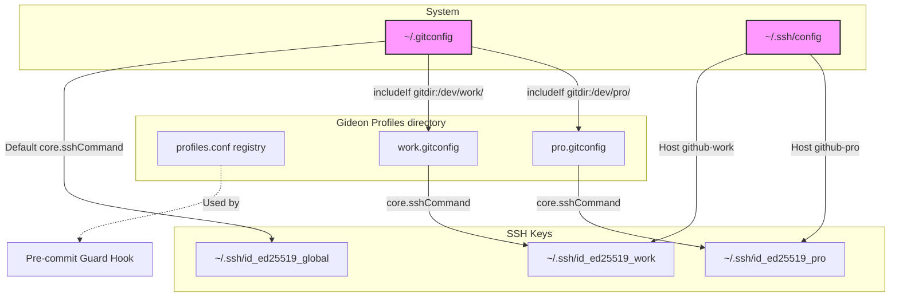

# Gideon Architecture

gideon is a zero-dependency, pure Bash 3.2 system designed to perfectly orchestrate Git identities across multiple environments. It is built to be strictly idempotent, entirely transparent, and robust enough to handle the most notorious edge cases in cross-platform development (CRLF line-endings, Windows pathing, and VirtualBox shared folder ownership).

## 🗺️ Configuration Architecture

At its core, Gideon stitches together `~/.gitconfig`, `~/.ssh/config`, and directory-specific profile configurations using Git's native `includeIf` capability.



## ✨ The Magical Clone (Intercept Flow)

Gideon's most powerful feature is its ability to seamlessly intercept standard `git clone` operations and automatically inject the correct SSH key mid-flight. This entirely eliminates the need for users to memorize or use custom SSH host aliases (`github-pro`) during cloning.

```mermaid
sequenceDiagram
    participant U as User
    participant Dir as Local Directory
    participant Git as Git Client
    participant Gid as Gideon Profile
    participant GH as GitHub

    U->>Dir: cd ~/dev/pro
    U->>Git: git clone git@github.com:repo.git
    
    rect rgb(30, 40, 50)
        Note right of Git: The Magical Intercept
        Git->>Dir: Initialize local .git/ directory
        Git->>Git: Evaluate includeIf rules
        Git->>Gid: Match gitdir: ~/dev/pro/
        Gid-->>Git: Inject core.sshCommand (id_ed25519_pro)
    end

    Git->>GH: Authenticate as "pro" identity
    GH-->>Git: Access Granted
    Git-->>Dir: Download Repository
    Dir-->>U: Clone Successful
```



## 🛡️ Managed Block Protocol

gideon uses comment markers to identify sections it owns in config files. This guarantees that your custom configurations are never touched or overwritten.

```ini
# [gideon:managed:start]
<content exclusively controlled by gideon>
# [gideon:managed:end]
```

### Rules of Idempotency
1. On **first run**: markers are appended to the file.
2. On **re-run**: everything between markers is surgically replaced. Content outside markers is strictly preserved.
3. On **teardown**: the entire block (markers inclusive) is cleanly deleted.

This makes all operations **idempotent** — running `gideon setup` ten times produces identical results to running it once.

## 🐛 Self-Healing Infrastructure

### CRLF VirtualBox Mitigation
VirtualBox shared folders (`vboxsf`) forcefully inject `\r` (CRLF) into every file on disk, breaking bash scripts because variable assignments get `\r` appended to their values. 

**gideon solves this at runtime with a self-healing block** at the very top of the main script:

```bash
# Line runs BEFORE set -euo pipefail
test "${GIDEON_CRLF_CLEAN:-}" = "1" || { export GIDEON_CRLF_CLEAN=1; export GIDEON_ORIG_SCRIPT="${BASH_SOURCE[0]:-$0}"; exec bash <(tr -d '\r' < "${BASH_SOURCE[0]:-$0}") "$@"; }
```

1. On first run, `GIDEON_CRLF_CLEAN` is unset → the test fails.
2. The script violently re-executes itself through `tr -d '\r'` via process substitution.
3. On native Linux/macOS (no CRLF), `tr -d '\r'` is a no-op with zero overhead.

### Dubious Ownership (`safe.directory`)
Git implements a strict security feature that disables configuration execution (like `includeIf`) if a repository folder is not owned by the current user. Shared mounts (VirtualBox, WSL) trigger this failure silently.

Gideon mitigates this natively. When you configure a profile directory, Gideon dynamically registers it in your `~/.gitconfig`:

```ini
[safe]
    directory = /media/sf_dev/pro/*
```
This guarantees that Git trusts your profile directories regardless of the underlying virtualization environment.

## 🏗️ Design Decisions

### Why Bash 3.2?
macOS ships bash 3.2 (GPLv2) and legally cannot ship 4+ (GPLv3). Requiring bash 4+ would mean forcing macOS users to install Homebrew, breaking the zero-dependency promise. All modern bash features (associative arrays, mapfile) have been meticulously replaced with portable POSIX/Bash 3.2 alternatives.

### Why not Go or Rust?
Zero dependency is the killer feature. Bash, Git, and ssh-keygen are available on every developer machine immediately. No version managers, no package managers, no binary downloads, and zero "binary rot." The tool works exactly as intended out of the box.
