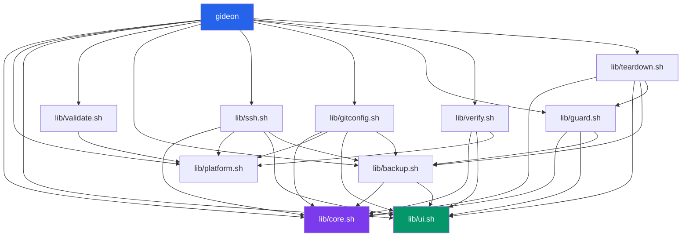

# Architecture

> This document describes the internal design of gideon. For usage, see [README.md](../README.md).
> For platform-specific issues, see [TROUBLESHOOTING.md](TROUBLESHOOTING.md).

## Module Dependency Graph



## Data Flow

```
User Input (prompts)
    │
    ▼
┌─────────────────────────────┐
│   Parallel Arrays (state)   │
│   PROFILE_LABELS[0..n]      │
│   PROFILE_NAMES[0..n]       │
│   PROFILE_EMAILS[0..n]      │
│   PROFILE_DIRS[0..n]        │
└─────────────┬───────────────┘
              │
              │
    ┌─────────┼─────────┐
    ▼         ▼         ▼
┌───────┐ ┌───────┐ ┌───────┐
│ssh.sh │ │gitcfg │ │guard  │
│       │ │  .sh  │ │  .sh  │
└───┬───┘ └───┬───┘ └───┬───┘
    │         │         │
    ▼         ▼         ▼
~/.ssh/    ~/.git     ~/.config/
 config    config     gideon/
~/.ssh/    ~/.config/  hooks/
 keys      gideon/     pre-commit
           profiles/
```

## Managed Block Protocol

gideon uses comment markers to identify sections it owns in config files:

```
# [gideon:managed:start]
<content controlled by gideon>
# [gideon:managed:end]
```

For profile-specific blocks:
```
# [gideon:managed:start] pro
<content for profile "pro">
# [gideon:managed:end] pro
```

### Rules

1. On **first run**: markers are added to the file (appended or as the entire content)
2. On **re-run**: everything between markers is replaced. Content outside markers is untouched.
3. On **removal**: the entire block (markers inclusive) is deleted.

This makes all operations **idempotent** — running `gideon setup` twice produces identical results.

## CRLF Self-Healing (VirtualBox)

VirtualBox shared folders (`vboxsf`) inject `\r` (CRLF) into every file on disk, regardless of how the file was written. This breaks bash scripts because variable assignments get `\r` appended to their values.

**gideon solves this at runtime with a self-healing block** at the top of the main script:

```bash
# Line runs BEFORE set -euo pipefail
test "${GIDEON_CRLF_CLEAN:-}" = "1" || { export GIDEON_CRLF_CLEAN=1; export GIDEON_ORIG_SCRIPT="${BASH_SOURCE[0]:-$0}"; exec bash <(tr -d '\r' < "${BASH_SOURCE[0]:-$0}") "$@"; }
```

### How it works:

1. On first run, `GIDEON_CRLF_CLEAN` is unset → the `test` fails
2. The script re-executes itself through `tr -d '\r'` via process substitution
3. `GIDEON_ORIG_SCRIPT` saves the real file path (since `BASH_SOURCE` becomes `/dev/fd/N` after re-exec)
4. `resolve_script_dir()` reads `GIDEON_ORIG_SCRIPT` to find the lib directory
5. All lib files are sourced via `gideon_source()` which also strips `\r`:
   ```bash
   gideon_source() { source <(tr -d '\r' < "$1"); }
   ```
6. On clean filesystems (no CRLF), `tr -d '\r'` is a no-op — zero overhead

### Why this matters:
- No other bash tool handles this edge case
- Makes gideon work directly on VirtualBox shared folders without manual line-ending fixes
- The fix is invisible to users on clean systems

## Configuration File Formats

### `~/.config/gideon/profiles.conf`

```
# gideon profile registry
# Format: label:email:directory
global:hmmbhaskar@gmail.com:
pro:bhaskarjha.com@gmail.com:/media/sf_dev/pro
work:bhaskar@company.com:/home/user/work
```

- Lines starting with `#` are comments
- Fields are colon-separated
- The default profile has an empty directory field
- Used by the guard hook for identity validation

### Per-profile gitconfig (`~/.config/gideon/profiles/<label>.gitconfig`)

Standard git config format, referenced by `includeIf` in `~/.gitconfig`:

```ini
[user]
    name = Bhaskar Jha
    email = bhaskarjha.com@gmail.com
[core]
    sshCommand = ssh -i ~/.ssh/id_ed25519_pro
```

## Bash 3.2 Compatibility

macOS ships bash 3.2 (GPLv2) and cannot upgrade to 4+ (GPLv3) by default. To maintain zero-dependency status, gideon avoids all bash 4+ features:

| Avoided Feature | Replacement |
|----------------|-------------|
| `declare -A` (associative arrays) | Parallel indexed arrays |
| `mapfile` / `readarray` | `while IFS= read -r` loops |
| `${var,,}` (lowercase) | `tr '[:upper:]' '[:lower:]'` |
| `|&` (pipe stderr) | `2>&1 |` |
| `;&` / `;;&` (case fallthrough) | Explicit `case` branches |
| `coproc` | Not needed |

## Security Considerations

- SSH private keys are generated with `chmod 600`
- `~/.ssh/config` is set to `chmod 600`
- `IdentitiesOnly yes` prevents SSH from trying all keys
- No credentials, tokens, or passwords are ever stored
- The guard hook only reads local config files — no network access
